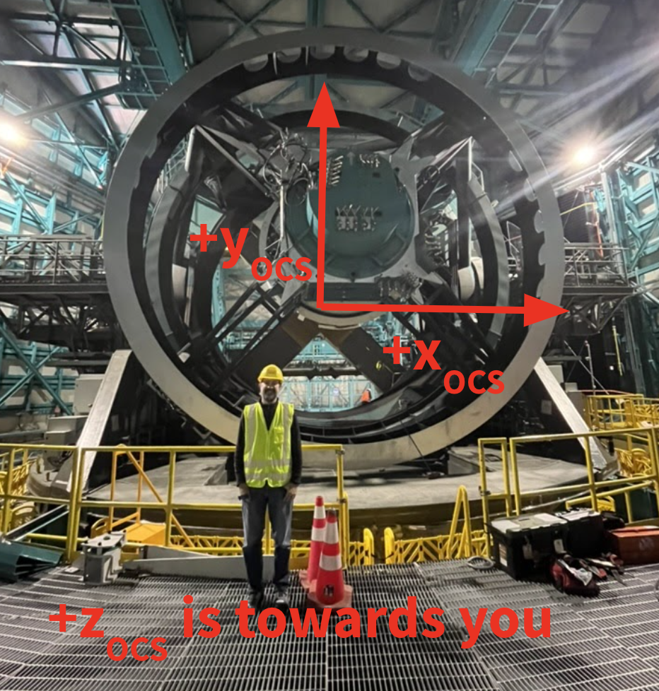
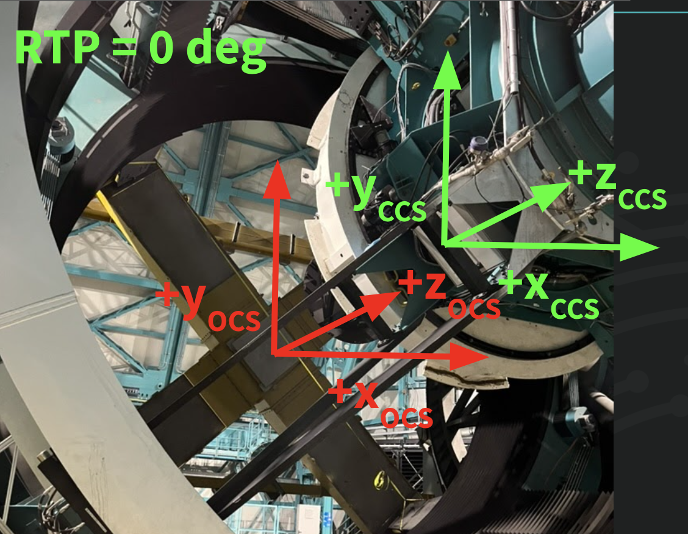
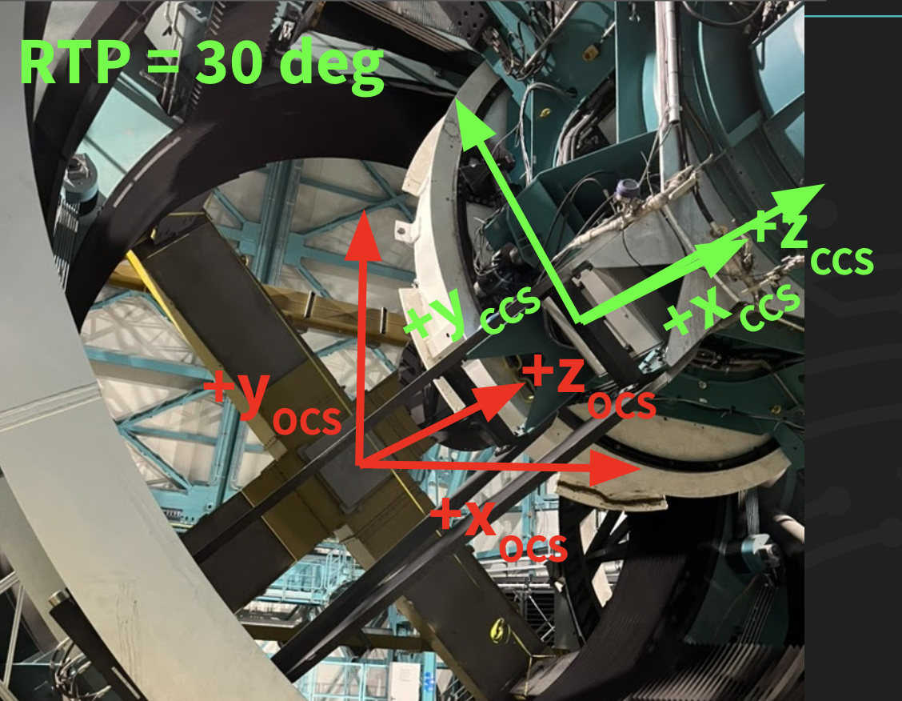
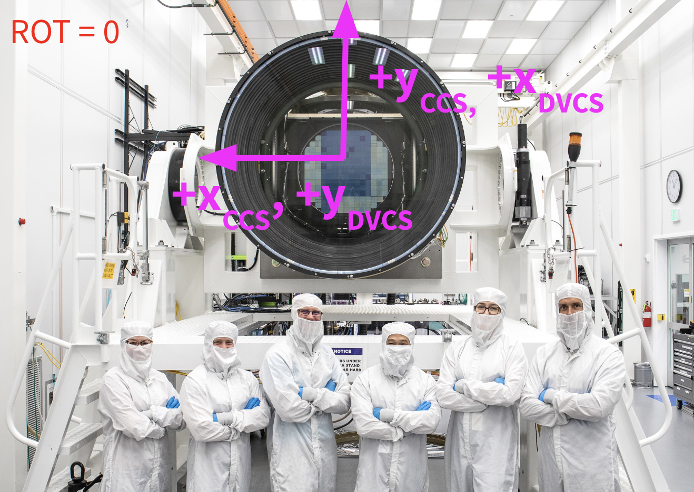
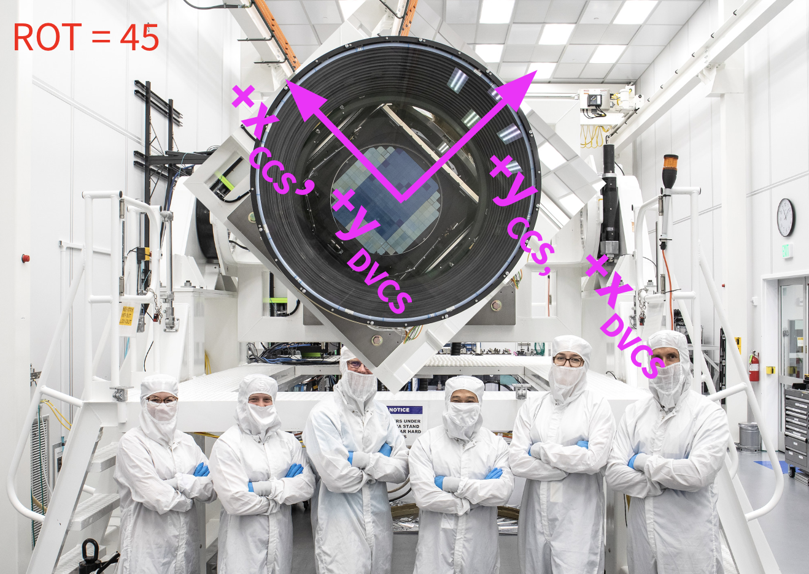
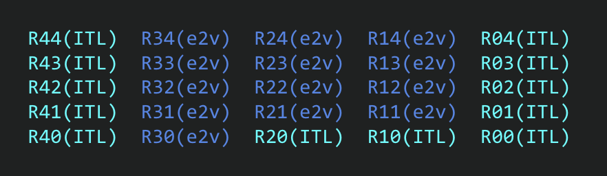

####################################
On-sky and hardware rotation angles.
####################################

.. abstract::

   The rotation angles ``RotTelPos`` and ``RotSkyPos`` are precisely defined
   and conversion routines are established.

Definitions
===========

Optical Coordinate System (OCS)
-------------------------------

See https://sitcomtn-003.lsst.io/#the-optical-coordinate-system.

When the telescope is pointed towards the horizon:

- :math:`+Z_\mathrm{OCS}` points from M1 towards the camera
- :math:`+Y_\mathrm{OCS}` points to zenith
- :math:`+X_\mathrm{OCS}` completes the right-handed coordinate system.
  It points towards the right as you look from the sky towards the reflective
  surface of M1.
- The OCS origin is the hypothetical vertex of M1.
- The OCS follows the TMA.

   Josh in front of TMA with OCS axes indicated.

Camera Coordinate System (CCS)
------------------------------

See https://sitcomtn-003.lsst.io/#lsstcam.

Summary:

- When ``RotTelPos`` is 0, the CCS is parallel to the OCS.
- The CCS origin is the vertex of L1S1.
- The CCS follows the camera, and rotates with the camera when the rotator is
  engaged.

   View from front of TMA, looking towards M1M3 mass surrogate (the large
   yellow X), with M2 surrogate and ComCam in the top right of the image.
   Camera Coordinate System when RotTelPos = 0 is indicated. (+Z_CCS is
   partially out-of-the-page.)

   Same as :ref:`Fig 2 <fig-CCS_RTP0>`, but indicating RotTelPos=30 degrees.
   When viewed from the sky towards M1M3, the camera rotates counter clockwise
   with increasing RotTelPos.

Data Visualization Coordinate System (DVCS)
-------------------------------------------

The DVCS is the primary focal plane coordinate system used by data management.
It is defined as the transpose of the CCS.  See https://ls.st/LSE-349 for more
details.

   LSSTCam in the clean room with CCS and DVCS axes indicated.  RotTelPos here
   is 0 degrees.

   The camera turns clockwise from this point of view as RotTelPos increases.

Note how you can infer the camera orientation from the differing layouts and
colors of the ITL and e2v CCDs.

   Camera Raft layout.  Dark blue rafts are e2v CCDs, light blue rafts are ITL
   CCDs.

Raft R24 lies along :math:`+Y_\mathrm{CCS}`, and R42 along
:math:`+X_\mathrm{CCS}`.

RotTelPos
---------
- This is the camera hardware rotator angle.
- When the camera is mounted on the telescope and the telescope is pointed to
  the horizon, a value of RotTelPos=0 orients the camera such that the
  :math:`+Y_\mathrm{CCS}` points towards zenith.
- A positive value of RotTelPos rotates the camera clockwise as viewed from
  M1M3 towards the camera.
- The range of RotTelPos is limited to -90 degrees to +90 degrees.

RotSkyPos
---------
- This is the orientation of the :math:`+Y_\mathrm{DVCS}` axis (projected on
  the sky) measured east of north in the International Celestial Reference
  Frame (ICRF).

Parallactic Angle
-----------------
- This is the position angle (measured east from *true* North) of zenith at a
  given sky coordinate.
- Note that the definition references true North, which is slightly different
  from ICRF North, and slowly precessing with Earth's axis.
- When converting between RotTelPos and RotSkyPos, we require the position
  angle of zenith measured east from *ICRF* North.

Pseudo Parallactic Angle
------------------------
- The position angle (measured east from *ICRF* North) of zenith at a given sky
  coordinate.
- I don't know of an official label for this angle.  I'm defining it as the
  pseudo parallactic angle here.

Converting from RotTelPos to RotSkyPos
======================================

Let's work out an example taking into account the various definitions above.
For the moment, we'll just focus on getting signs right.

Imagine pointing just above the ICRF South Celestial Pole.  For concreteness
we'll target HD116244 at sunset on Vera Rubin's 100th birthday:

- ra_ICRF = 13:25:5.13
- dec_ICRF = -74:53:32.6
- MJD = 61975.91735

Here's the view from Stellarium:

.. figure:: ./_static/HD116244.png

   HD116244.  We're observing just above the South Celestial Pole (the
   convergence of blue lines indicates the (true) SCP).  At the position of
   HD116244, zenith is "up", north is "up", east is "left".

From here, the direction to zenith and the direction to the North Celestial
Pole are almost the same.  I.e., the parallactic and pseudo parallactic angles
are both nearly 0.

Let's say that RotTelPos = 0 degrees.  Then Fig. 6 shows us that R24 is
physically "up" inside the camera, in the sense that it is farther from the
center of the Earth than R20.  However, as a consequence of the odd number of
mirrors in the Simonyi Survey Telescope, when projected onto the sky, *the
image is rotated 180 degrees!*  (Or equivalently, reflected through the
origin). R20 is projected towards the top of Fig. 7, and R24 towards the
bottom.  Similarly, R42, which lies along :math:`+Y_\mathrm{DVCS}`, is
projected towards the right of the Fig. 7.  Since RotSkyPos is the orientation
of :math:`+Y_\mathrm{DVCS}` ("right") measured east ("left") of north ("up"),
we can see that it's about +270 degrees here.

Recall that increasing RotTelPos rotates the camera clockwise when viewed from
M1M3.  I.e., R42 rotates towards R43, which must still be true when both are
projected onto the sky.  Since the projection onto the sky is also just a
rotation, we conclude that increasing RotTelPos rotates the projection of the
camera clockwise on the sky.  If we set RotTelPos = 45 degrees, that makes
:math:`+Y_\mathrm{DVCS}` rotate from "right" to "top right", and we see that
RotSkyPos = +225 degrees.  So increasing RotTelPos results in decreasing
RotSkyPos.

Finally, imagine observing HD116244 a few hours later, for concreteness at

- MJD = 61976.03248

Here's the new view from Stellarium:

.. figure:: ./_static/HD116244_later.png

   HD116244 a few hours later.  The Zenith is still "up", but now the South
   Celestial Pole is in the lower left.  At the position of HD116244, north
   is "up and right", east is "up and left".

Since the parallactic angle is the direction of zenith from north through east,
we can eyeball it at about +45 degrees.

As before, setting RotTelPos = 0 degrees places the projection of R42 (i.e.,
the projection of :math:`+Y_\mathrm{DVCS}`) towards the right.  We can now
eyeball the value of RotSkyPos as the angle from north ("up and right") through
east ("up and left") of :math:`+Y_\mathrm{DVCS}` ("right"), about +315 degrees.
So increasing the parallactic angle at fixed RotTelPos increases RotSkyPos.

Combining the above, and using :math:`q` for the (pseudo) parallactic angle, we
arrive at the relation:

.. math:: \mathrm{RotSkyPos} = 270^{\circ} - \mathrm{RotTelPos} + q

The final wrinkle is that we'd like our definition of RotSkyPos to reference
ICRF north and not true north.  This means that for precise results we need to
use the pseudo parallactic angle.  Unfortunately, this value isn't readily
available in most astrometry libraries.  We provide a routine to compute it
directly below.

Code
====

The following code can be used to transform between RotSkyPos and RotTelPos.
We use the precise relation that uses the pseudo parallactic angle.  We've also
added interfaces for setting the ambient pressure, temperature, relative
humidity, observation wavelength, and observatory coordinates.

Note that like all astrometric computations, results can be sensitive to which
Earth ellipsoid, precession and nutation models you use.

.. code-block:: python

    import astropy.units as u
    from astropy.coordinates import AltAz, Angle, EarthLocation, SkyCoord
    from astropy.time import Time

    def pseudo_parallactic_angle(
        ra: float,
        dec: float,
        mjd: float,
        lon: float = -70.7494,
        lat: float = -30.2444,
        height: float = 2650.0,
        pressure: float = 750.0,
        temperature: float = 11.5,
        relative_humidity: float = 0.4,
        obswl: float = 1.0,
    ):
        """Compute the pseudo parallactic angle.

        The (traditional) parallactic angle is the angle zenith - coord - NCP
        where NCP is the true-of-date north celestial pole.  This function instead
        computes zenith - coord - NCP_ICRF where NCP_ICRF is the north celestial
        pole in the International Celestial Reference Frame.

        Parameters
        ----------
        ra, dec : float
            ICRF coordinates in degrees.
        mjd : float
            Modified Julian Date.
        latitude, longitude : float
            Geodetic coordinates of observer in degrees.
        height : float
            Height of observer above reference ellipsoid in meters.
        pressure : float
            Atmospheric pressure in millibars.
        temperature : float
            Atmospheric temperature in degrees Celsius.
        relative_humidity : float
        obswl : float
            Observation wavelength in microns.

        Returns
        -------
        ppa : float
            The pseudo parallactic angle in degrees.
        """
        obstime = Time(mjd, format="mjd", scale="tai")
        location = EarthLocation.from_geodetic(
            lon=lon * u.deg,
            lat=lat * u.deg,
            height=height * u.m,
            ellipsoid="WGS84",  # For concreteness
        )

        coord_kwargs = dict(
            obstime=obstime,
            location=location,
            pressure=pressure * u.mbar,
            temperature=temperature * u.deg_C,
            relative_humidity=relative_humidity,
            obswl=obswl * u.micron,
        )

        coord = SkyCoord(ra * u.deg, dec * u.deg, **coord_kwargs)

        towards_zenith = SkyCoord(
            alt=coord.altaz.alt + 10 * u.arcsec,
            az=coord.altaz.az,
            frame=AltAz,
            **coord_kwargs
        )

        towards_north = SkyCoord(
            ra=coord.icrs.ra, dec=coord.icrs.dec + 10 * u.arcsec, **coord_kwargs
        )

        ppa = coord.position_angle(towards_zenith) - coord.position_angle(towards_north)
        return ppa.wrap_at(180 * u.deg).deg

    def rtp_to_rsp(rotTelPos: float, ra: float, dec: float, mjd: float, **kwargs: dict):
        """Convert RotTelPos -> RotSkyPos.

        Parameters
        ----------
        rotTelPos : float
            Camera rotation angle in degrees.
        ra, dec : float
            ICRF coordinates in degrees.
        mjd : float
            Modified Julian Date.
        **kwargs : dict
            Other keyword arguments to pass to pseudo_parallactic_angle.  Defaults
            are generally appropriate for Rubin Observatory.

        Returns
        -------
        rsp : float
            RotSkyPos in degrees.
        """
        q = pseudo_parallactic_angle(ra, dec, mjd, **kwargs)
        return Angle((270 - rotTelPos + q)*u.deg).wrap_at(180 * u.deg).deg

    def rsp_to_rtp(rotSkyPos: float, ra: float, dec: float, mjd: float, **kwargs: dict):
        """Convert RotTelPos -> RotSkyPos.

        Parameters
        ----------
        rotSkyPos : float
            Sky rotation angle in degrees.
        ra, dec : float
            ICRF coordinates in degrees.
        mjd : float
            Modified Julian Date.
        **kwargs : dict
            Other keyword arguments to pass to pseudo_parallactic_angle.  Defaults
            are generally appropriate for Rubin Observatory.

        Returns
        -------
        rsp : float
            RotSkyPos in degrees.
        """
        q = pseudo_parallactic_angle(ra, dec, mjd, **kwargs)
        return Angle((270 - rotSkyPos + q)*u.deg).wrap_at(180 * u.deg).deg

Finishing the example
=====================

Here's our example coded up:

.. code-block:: python

    import warnings
    from astropy.utils.exceptions import AstropyWarning
    with warnings.catch_warnings():
        warnings.simplefilter('ignore', AstropyWarning)

        ra = Angle("13h25m05.13s").deg
        dec = Angle("-74d53m32.5s").deg
        mjd = 61975.91735

        print("pseudo parallactic angle")
        print(pseudo_parallactic_angle(ra, dec, mjd), "  deg")
        print("expect ~0 deg")
        print()

        # Check astroplan parallactic angle
        from astroplan import Observer
        coord = SkyCoord(ra*u.deg, dec*u.deg)
        observer= Observer.at_site("LSST")
        obstime = Time(mjd, format='mjd', scale='tai')
        print("parallactic angle from astroplan")
        print(observer.parallactic_angle(obstime, coord).deg, "  deg")
        print("expect ~0 deg")
        print()

        print("RotSkyPos when RotTelPos ~ 0, q ~ 0")
        print(rtp_to_rsp(0.0, ra, dec, mjd), "  deg")
        print("expect ~ -90 deg")
        print()
        print("RotSkyPos when RotTelPos ~ 45, q ~ 0")
        print(rtp_to_rsp(45.0, ra, dec, mjd), "  deg")
        print("expect ~ -135 deg")
        print()

        mjd2 = 61976.03248
        print("RotSkyPos when RotTelPos ~ 0, q ~ 45")
        print(rtp_to_rsp(0.0, ra, dec, mjd2), "  deg")
        print("expect ~ -45 deg")
        print()

It yields:

.. code-block::

    pseudo parallactic angle
    -0.2069151032773199   deg
    expect ~0 deg

    parallactic angle from astroplan
    0.28310081072723475   deg
    expect ~0 deg

    RotSkyPos when RotTelPos ~ 0, q ~ 0
    -90.20691510327731   deg
    expect ~ -90 deg

    RotSkyPos when RotTelPos ~ 45, q ~ 0
    -135.2069151032773   deg
    expect ~ -135 deg

    RotSkyPos when RotTelPos ~ 0, q ~ 45
    -40.95945312926989   deg
    expect ~ -45 deg
